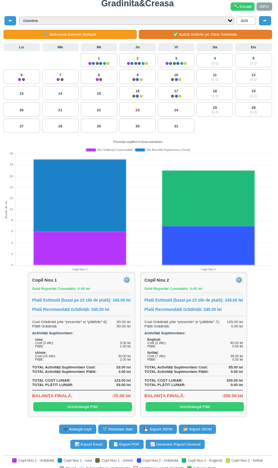
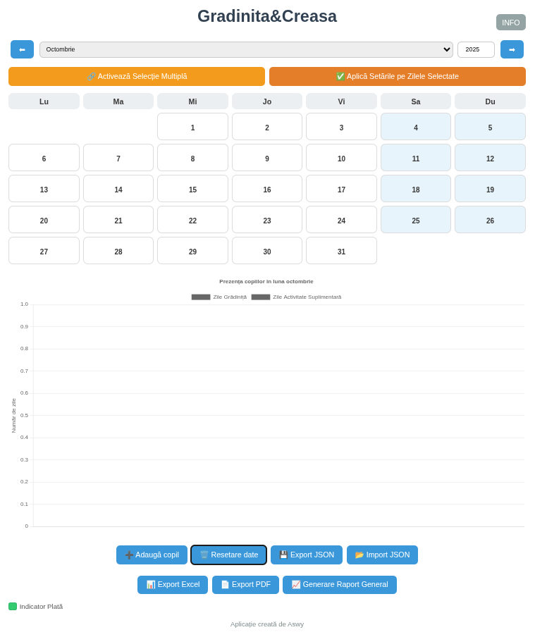

🧸 Grădiniță&Creasă

Aplicație web simplă și intuitivă pentru gestionarea prezenței și plăților copiilor la grădiniță sau creșă.

🎯 Descriere generală

Grădiniță&Creasă este o aplicație creată pentru părinți care doresc să țină evidența prezenței copiilor la grădiniță sau creșă și a costurilor aferente.
Permite gestionarea mai multor copii, activități suplimentare (ex: engleză, rusă, dans etc.), precum și exportul datelor în formate ușor de utilizat.

| Setări copil              | Istoric plăți              | Calendar principal              |
| ------------------------- | -------------------------- | ------------------------------- |
|  |  |  |

	
	
🪄 Cum se folosește aplicația

Deschide pagina aplicației în browser.
In functie de versiune este necesar sa se faca un reset de date si sa se streaga copii impliciti Casian si Ezra.

Apoi e nevoie sa se adauge un copil. Apoi se poate da un refres la pagina.

Dă click pe cele trei puncte (⋮) din colțul din dreapta sus al browserului (pe telefon).

Alege opțiunea „Adaugă pe ecranul principal” pentru a o instala ca aplicație rapidă (PWA).

După instalare, aplicația poate fi deschisă direct de pe ecran, fără conexiune permanentă la internet.

Adaugă copiii și activitățile dorite, apoi folosește calendarul pentru a marca zilele de prezență.

Poți exporta oricând datele în format PDF, Excel sau JSON.

🔐 Confidențialitate și date colectate

Datele sunt stocate doar pe dispozitiv.

Aplicația nu colectează date personale.
Singurele informații colectate sunt strict în scop de dezvoltare, pentru a îmbunătăți funcționalitatea aplicației:

numărul total de utilizatori activi

câți copii sunt adăugați în aplicație

câte activități suplimentare sunt definite

👉 Aceste date sunt complet anonime și nu pot fi asociate cu persoane reale.

✨ Funcționalități principale

🗓️ Calendar lunar interactiv

👶 Adăugare / ștergere copii

🎨 Activități suplimentare personalizate

💰 Calcul automat al plăților

📊 Grafic general și rapoarte lunare

📁 Export / Import în JSON, Excel, PDF

💾 Salvare locală automată (fără cont, fără servere externe)

💖 Donează pentru proiect

Aplicația este gratuită pentru uz personal.  
Dacă îți este utilă și vrei să sprijini dezvoltarea ei, poți face o mică donație direct în contul de mai jos:

  

  <b>IBAN pentru donații:</b> 
  <code>RO31INGB0000999901856836</code>  
   (Aswy)

🧱 Tehnologii utilizate

HTML

JavaScript

CSS

⚠️ Licență și drepturi

Aplicația este gratuită pentru uz personal.

Codul sursă este public, dar nu poate fi utilizat în scop comercial.

Aswy deține toate drepturile de comercializare și distribuire.

🌱 Planuri și dezvoltare viitoare

Aplicația va primi îmbunătățiri treptate, în funcție de timpul liber disponibil.
Eu însumi sunt părinte și dezvolt această aplicație din dorința de a ajuta alți părinți să își gestioneze mai ușor prezența și plățile copiilor la grădiniță.
Voi continua să adaug funcționalități noi în funcție de necesități și feedback.
Mulțumesc tuturor celor care susțin proiectul! ❤️

📩 Contact

✉️ gradinita@aswy.ro

🌐 Pagina oficială

🔗 https://github.com/Aswy13/gradinita
