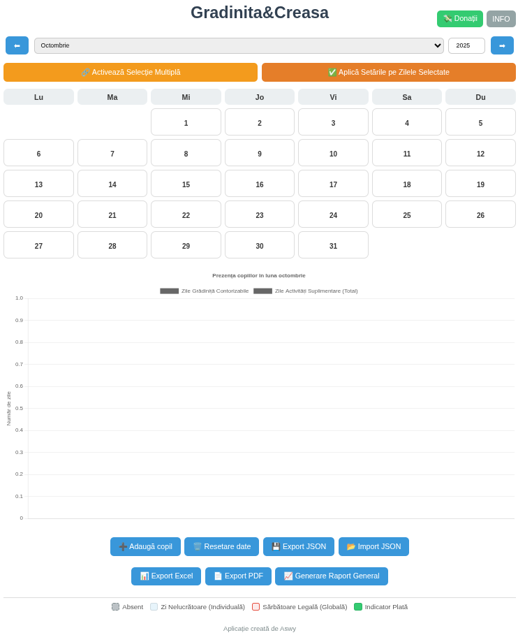
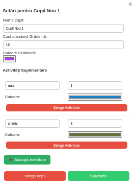

🧸 Grădiniță&Creasă

Aplicație web simplă și intuitivă pentru gestionarea prezenței și plăților copiilor la grădiniță sau creșă.

    

🎯 Descriere generală

Grădiniță&Creasă este o aplicație creată pentru părinți, pentru a urmări ușor prezența copiilor la grădiniță sau creșă și pentru a calcula automat costurile lunare.
Poți adăuga activități suplimentare, gestiona culori personalizate și exporta datele în mai multe formate.

| Setări copil              | Istoric plăți              | Calendar principal              |
| ------------------------- | -------------------------- | ------------------------------- |
|  |  |  |

✨ Funcționalități principale

🗓️ Calendar interactiv lunar pentru marcarea prezenței

👶 Adăugare / modificare copii

🎨 Activități suplimentare (ex: engleză, rusă, dans, etc.)

💰 Calcul automat al costurilor și totalurilor pe lună

📊 Grafic al prezențelor și activităților

📁 Export și import în formate JSON, Excel și PDF

💾 Salvare automată locală (nu este nevoie de cont)

💬 Sugestii și suport: gradinita@aswy.ro

🧱 Tehnologii utilizate

HTML

JavaScript

CSS (interfață minimalistă, clară și intuitivă)

💖 Donează pentru proiect

Aplicația este gratuită pentru uz personal. Dacă îți este utilă și vrei să sprijini dezvoltarea ei, poți face o mică donație.

  

⚠️ Licență și drepturi

Aplicația este gratuită pentru uz personal.

Codul sursă este public, dar nu poate fi folosit în scop comercial.

Aswy deține toate drepturile de comercializare și distribuire.

🌐 Pagina oficială

🔗 https://github.com/Aswy13/gradinita
